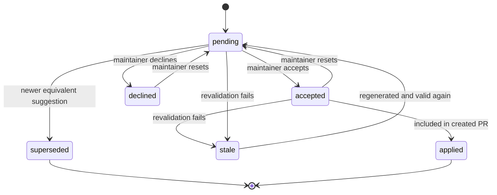

# Suggestion Inbox Architecture and Rollout Spec (SYN-53)

*Last updated: 2026-03-04.*

---

## 1. Goal

Replace the current auto-PR workflow with a maintainer-controlled suggestion inbox:

1. AI runs detect documentation changes and persist suggestions.
2. Maintainers review each suggestion in the web UI (`accept` / `decline` / `reset`).
3. Maintainers explicitly trigger `Create PR` to publish accepted suggestions.

This document is the architecture and rollout contract for issue `SYN-53`.

## 2. Problem Statement

Current behavior creates documentation PRs automatically per eligible run. This causes:

1. PR volume growth for active repositories.
2. Limited ability to reject specific suggestions while preserving others.
3. Implicit publishing control in automation instead of maintainers.

## 3. Scope and Non-Goals

### 3.1 In Scope

1. Suggestion persistence model and lifecycle.
2. API and worker boundary changes required for inbox flow.
3. Feature-flagged rollout strategy.
4. Rollback strategy and safety gates.

### 3.2 Out of Scope

1. Final UI visual design details.
2. New AI model changes or prompt tuning beyond compatibility needs.
3. Migration of unrelated roadmap items.

## 4. Target Architecture

### 4.1 High-Level Flow

```text
GitHub webhook (merge/manual run trigger)
  -> worker pipeline (triage + generation)
  -> persist Suggestion records (no PR creation)
  -> maintainers review in UI
  -> POST create-pr action
  -> revalidate accepted suggestions against docs HEAD
  -> create GitHub PR from valid accepted suggestions
```

### 4.2 Domain Entities

1. `AnalysisRun` (existing): keeps pipeline execution history.
2. `Suggestion` (new): first-class review item generated by a run.
3. `SuggestionBatch` (new): one explicit `Create PR` execution event.

### 4.3 Suggestion State Model

Allowed states:

1. `pending` (default)
2. `accepted`
3. `declined`
4. `superseded`
5. `stale`
6. `applied`

State transition diagram:



Invariant rules:

1. `applied` and `superseded` are terminal for user decisions.
2. `stale` is excluded from PR creation until revalidated.
3. Only authorized maintainers can mutate decision states.

## 5. Representation and Conflict Strategy

### 5.1 Suggestion Representation

`SYN-53` decision: store full-file proposed content per suggestion (not hunk patch) for MVP.

Rationale:

1. Lower implementation risk.
2. Deterministic apply path in PR creation.
3. Easier to reason about state and revalidation.

### 5.2 Deduplication and Supersede

Each suggestion includes a deterministic `fingerprint` to support:

1. dedupe across runs,
2. superseding older equivalent suggestions,
3. decision memory for declined items.

### 5.3 Conflict Policy (MVP)

During PR creation:

1. At most one accepted effective suggestion per file is included.
2. Conflicting accepted suggestions are excluded with explicit conflict reasons.
3. The PR still proceeds with the non-conflicting subset.

## 6. Component Responsibilities

### 6.1 Worker (`apps/worker`)

1. Keep triage and generation behavior.
2. Persist suggestions for meaningful doc changes.
3. Do not create documentation PRs when inbox workflow is enabled.
4. Update run result metadata (`suggestionsCount`, timing, token usage).

### 6.2 API (`apps/api`)

1. Provide suggestion listing and decision mutation endpoints.
2. Provide explicit create-PR endpoint that:
   - collects accepted suggestions,
   - revalidates against docs repo HEAD,
   - applies valid suggestions,
   - opens PR,
   - writes `SuggestionBatch` result and marks suggestions `applied`.

### 6.3 Web (`apps/web`)

1. Expose a project-level suggestion inbox.
2. Support per-item and bulk review actions.
3. Provide `Create PR` UX with include/exclude summary.

## 7. API Contract (Planned)

1. `GET /projects/:projectId/suggestions`
2. `PATCH /projects/:projectId/suggestions/:suggestionId`
3. `POST /projects/:projectId/suggestions/bulk`
4. `POST /projects/:projectId/suggestions/create-pr`
5. `GET /projects/:projectId/suggestion-batches/:batchId`

All mutation routes require project maintainer authorization.

## 8. Feature Flags and Rollout Plan

Flags:

1. `SYNK_SUGGESTION_INBOX_ENABLED`
2. `SYNK_AUTOPR_DISABLED`
3. `SYNK_SUGGESTION_DECISION_MEMORY_ENABLED`
4. Operational runbook: `docs/SUGGESTION-INBOX-ROLLOUT-RUNBOOK.md`

### 8.1 Rollout Phases

1. **Phase A (schema + write path dark launch)**
   - Enable suggestion persistence in worker.
   - Keep legacy auto-PR enabled.
   - Verify data correctness and counts.
2. **Phase B (review path)**
   - Enable inbox API and web UI for internal/staging users.
   - Validate decision transitions and auth.
3. **Phase C (publish path)**
   - Enable create-PR endpoint and UI action.
   - Keep auto-PR off only for opted-in projects.
4. **Phase D (default switch)**
   - Set `SYNK_AUTOPR_DISABLED=true` broadly.
   - Keep rollback switch available until stability window closes.

### 8.2 Rollout Gates

Advance phase only if:

1. No critical auth/data integrity regressions.
2. PR creation success rate is acceptable in staging.
3. Stale/conflict handling is user-actionable and explicit.
4. Existing runs dashboard behavior remains intact.

## 9. Rollback Plan

Primary rollback path:

1. Disable `SYNK_SUGGESTION_INBOX_ENABLED`.
2. Enable legacy auto-PR path (`SYNK_AUTOPR_DISABLED=false`).
3. Keep persisted suggestions for diagnostics; no data deletion required.

Rollback safety notes:

1. Schema additions are backward compatible.
2. Existing run listing APIs remain valid.
3. Rollback does not require migration reversal.

## 10. Observability Requirements

Minimum instrumentation for rollout:

1. Suggestions generated/accepted/declined/applied counts.
2. Create-PR success/failure and exclusion reasons.
3. Correlation IDs across run -> suggestion -> batch -> PR.

## 11. Risks and Mitigations

1. **Risk:** stale accepted suggestions at PR time.
   - **Mitigation:** mandatory revalidation and explicit exclusion reasons.
2. **Risk:** repeated re-suggestion of declined changes.
   - **Mitigation:** fingerprint-based decision memory.
3. **Risk:** maintainers create oversized PRs.
   - **Mitigation:** include/exclude summary and batch-level feedback.

## 12. Acceptance Criteria for SYN-53

1. Architecture document is merged and discoverable in `docs/`.
2. Lifecycle states and transitions are explicitly defined.
3. Feature flag rollout and rollback steps are documented.
4. Non-goals and risks are documented to bound follow-up implementation work.
